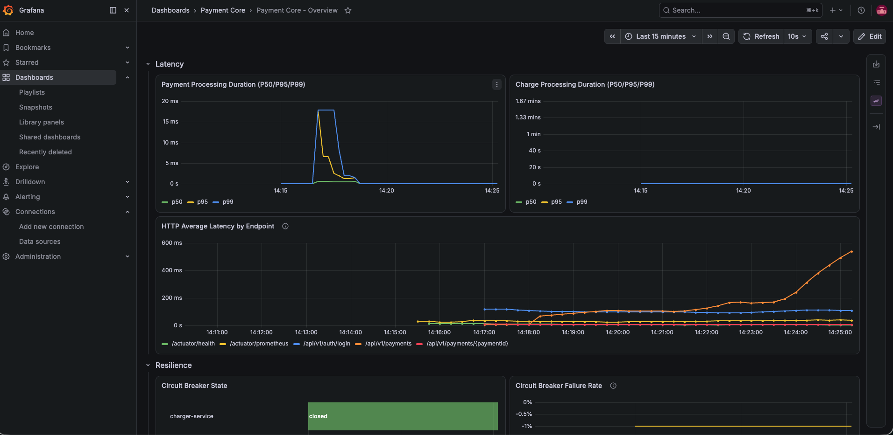
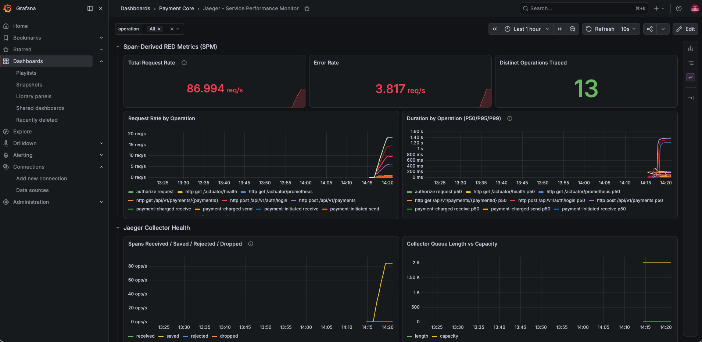
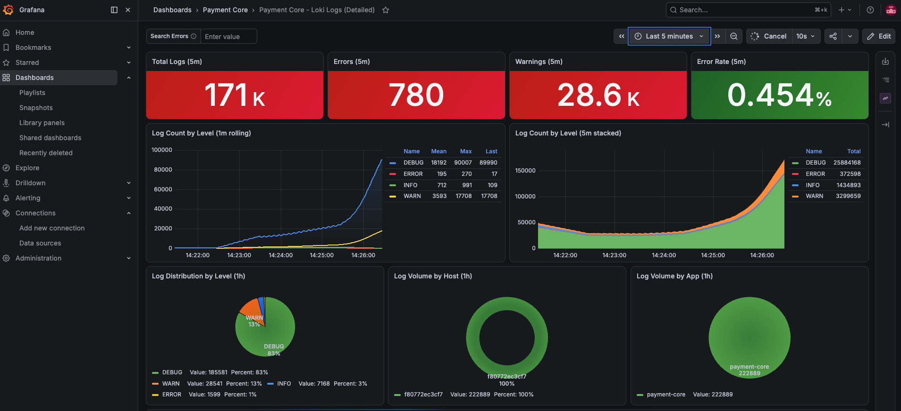

# Payment Core System

[](https://github.com/orvigas/payment-core/releases/latest)

A payment processing service built with Spring Boot 3, PostgreSQL, and Apache Kafka. It exposes a JWT-secured REST API for payment operations, processes charges asynchronously through Kafka events, and ships with a full local observability stack (Prometheus, Jaeger) and a k6 load testing suite.

## Documentation

| Document | Contents |
|---|---|
| [docs/ARCHITECTURE.md](docs/ARCHITECTURE.md) | Layered design, data model, payment lifecycle, Kafka event flow, key design decisions |
| [docs/DEPLOYMENT.md](docs/DEPLOYMENT.md) | Build, Docker Compose topology, configuration, database reset behavior, production checklist |
| [docs/PERFORMANCE.md](docs/PERFORMANCE.md) | Tuning values (HikariCP, Hibernate, Kafka), resilience thresholds, load testing and measurement workflow |
| [docs/SECURITY.md](docs/SECURITY.md) | Authentication flow, endpoint authorization, rate limiting, known gaps before production |
| [loadtest/README.md](loadtest/README.md) | k6 test scenarios, seeding, thresholds, troubleshooting |
| [docs/INSOMNIA-COLLECTION.md](docs/INSOMNIA-COLLECTION.md) | Importable API collection for manual testing |
| [CHANGELOG.md](CHANGELOG.md) | Notable changes per release |

## Features

- RESTful API for payment operations (create, retrieve, confirm, refund) under `/api/v1/payments`
- JWT authentication with access and refresh tokens (`/api/v1/auth`), BCrypt password storage, stateless sessions
- Rate limiting on login (10/min) and payment creation (100/h) via Resilience4j
- Event-driven processing with Apache Kafka: charging, notifications, and analytics run as independent consumers
- PostgreSQL with Flyway-managed schema migrations and strategic indexing
- Immutable API contracts and events using Java Records
- Global exception handling with structured error responses
- Resilience patterns: circuit breakers, retries, timeouts (Resilience4j)
- Observability: Prometheus metrics, Jaeger distributed tracing, custom Micrometer metrics
- Interactive API documentation with Swagger UI / OpenAPI 3.1
- About 260 unit and integration tests; the build enforces a 95% instruction coverage minimum (JaCoCo)
- k6 load testing suite with seeded credentials and baseline analysis

## Tech Stack

| Area | Technology |
|---|---|
| Language / Framework | Java 21 LTS, Spring Boot 3.5.16 (Spring 6.2.x) |
| Persistence | PostgreSQL 15, Spring Data JPA (Hibernate), Flyway migrations, HikariCP |
| Security | Spring Security, JWT (jjwt, HMAC-SHA256), BCrypt |
| Messaging | Apache Kafka (Confluent images), Spring Kafka 3.3.16, JSON serialization |
| Resilience | Resilience4j (circuit breaker, retry, time limiter, rate limiter) |
| Observability | Spring Boot Actuator, Micrometer, Prometheus, Jaeger (via Zipkin protocol), Grafana, Loki (via loki-logback-appender) |
| API docs | springdoc-openapi 2.8.6 (2.8.x is required for Spring Boot 3.5; older versions fail at runtime) |
| Testing | JUnit 5, Mockito, H2 in-memory database, embedded Kafka (spring-kafka-test), JaCoCo 0.8.12 |
| Build / Runtime | Maven 3.8+, Docker, Docker Compose, Lombok |

## Quick Start

### Prerequisites

- Java 21 or higher
- Maven 3.8 or higher
- Docker and Docker Compose
- Optional: [k6](https://grafana.com/docs/k6/latest/) for load testing, `psql` for manual database access

### Run the stack

```bash
git clone https://github.com/orvigas/payment-core.git
cd payment-core

# Build and run tests
mvn clean package

# Start everything: PostgreSQL, Zookeeper, Kafka, Prometheus, Jaeger, the app,
# and a db-seed job that creates the load test user after the app is healthy
docker-compose up -d

# Wait for the app to become healthy
curl http://localhost:8080/actuator/health
```

On startup, Flyway drops and recreates the schema from the migrations in `src/main/resources/db/migration/` (development default; see [docs/DEPLOYMENT.md](docs/DEPLOYMENT.md) before pointing at any non-disposable database). The `db-seed` container then inserts the `load_test_user` account.

### Authenticate

All payment endpoints require a JWT. Log in with the seeded development user to get one:

```bash
curl -s -X POST http://localhost:8080/api/v1/auth/login \
  -H "Content-Type: application/json" \
  -d '{"username": "load_test_user", "password": "LoadTest123!"}'
```

Response:

```json
{
  "accessToken": "eyJhbGciOiJIUzI1NiJ9...",
  "refreshToken": "eyJhbGciOiJIUzI1NiJ9...",
  "tokenType": "Bearer",
  "expiresIn": 3600,
  "userId": "load_test_user"
}
```

Use the access token in the `Authorization` header for every payment call. Access tokens live 1 hour; use `POST /api/v1/auth/refresh` with the refresh token to get a new one.

### Create a payment

```bash
TOKEN="<accessToken from login>"

curl -s -X POST http://localhost:8080/api/v1/payments \
  -H "Authorization: Bearer $TOKEN" \
  -H "Content-Type: application/json" \
  -d '{
    "amount": 5000.00,
    "currency": "MXN",
    "merchant": "jersey-mikes",
    "description": "Order #123"
  }'
```

The payment's owner is always the authenticated caller (the JWT subject), not a request field, so a token can never be used to create a payment attributed to another user. The payment is created in `PENDING` status and charged asynchronously via Kafka; see the event flow in [docs/ARCHITECTURE.md](docs/ARCHITECTURE.md).

### API documentation

With the application running:

- Swagger UI: `http://localhost:8080/swagger-ui.html`
- OpenAPI specification (JSON): `http://localhost:8080/v3/api-docs`

## API Endpoints

| Method | Path | Auth | Description |
|---|---|---|---|
| POST | `/api/v1/auth/login` | Public (rate limited: 10/min) | Exchange username/password for JWT access and refresh tokens |
| POST | `/api/v1/auth/refresh` | Refresh token | Get a new access token |
| POST | `/api/v1/payments` | Bearer token (rate limited: 100/h) | Create a payment owned by the caller (`201 Created`) |
| GET | `/api/v1/payments/{paymentId}` | Bearer token, owner only | Retrieve a payment |
| POST | `/api/v1/payments/{paymentId}/confirm` | Bearer token, owner only | Confirm a `PENDING` payment |
| POST | `/api/v1/payments/{paymentId}/refund` | Bearer token, owner only | Refund a `COMPLETED` payment |

Error responses are structured JSON produced by `GlobalExceptionHandler`:

```json
{
  "timestamp": "2026-07-01T12:34:56.789Z",
  "status": 400,
  "error": "InvalidPaymentException",
  "message": "Only PENDING payments can be confirmed"
}
```

Common statuses: `400` validation or invalid state transition, `401` missing/invalid token, `403` payment belongs to a different user, `404` unknown payment, `429` rate limit exceeded, `500` unexpected failure.

## Architecture Overview

Full detail in [docs/ARCHITECTURE.md](docs/ARCHITECTURE.md); the short version:

```text
Client
  |  HTTPS + JWT (JwtAuthenticationFilter)
  v
Controllers (PaymentController, AuthController)
  |
Services (PaymentService, PaymentValidator)     -- @Transactional business logic
  |                          \
Repositories (JPA)            PaymentProducer -> Kafka topics
  |                                                 |
PostgreSQL (Flyway V001-V008)      ChargingConsumer / NotificationConsumer / AnalyticsConsumer
```

- **Synchronous path**: controller, service, repository. Records as request/response contracts, two-level validation (Bean Validation plus `PaymentValidator`), exception translation to structured errors.
- **Asynchronous path**: `POST /api/v1/payments` persists the payment as `PENDING` and publishes `PaymentInitiatedEvent`; the charging consumer processes the charge and drives the payment to `COMPLETED` or `FAILED`, publishing `PaymentChargedEvent` for notifications and analytics.
- **Lifecycle**: `PENDING -> PROCESSING -> COMPLETED -> REFUNDED`, with `FAILED` as the other terminal state. Invalid transitions return `400`.
- **Security**: stateless JWT authentication; users live in the `users` table (BCrypt hashes) and the token subject is the user's UUID `userId`. See [docs/SECURITY.md](docs/SECURITY.md).

### Source layout

```text
src/main/java/com/payment/
├── config/          # SecurityConfig, KafkaConfig, RateLimitingConfig, ResilienceConfig, FlywayConfig
├── contracts/       # CreatePaymentRequest, PaymentResponse, LoginRequest, LoginResponse (Records)
├── controllers/     # PaymentController, AuthController
├── errors/          # GlobalExceptionHandler + custom exceptions
├── events/          # Payment*Event records published to Kafka
├── kafka/           # PaymentProducer, consumers, KafkaTopics constants
├── models/          # Payment, PaymentStatus, User, Role (JPA)
├── observability/   # CustomMetrics (Micrometer counters, timers, gauges)
├── repositories/    # PaymentRepository, UserRepository
├── security/        # JwtTokenProvider, JwtAuthenticationFilter, CustomUserDetailsService
└── services/        # PaymentService, PaymentValidator

src/main/resources/
├── application.yml
├── logback-spring.xml   # console, rolling-file, and Loki (Loki4jAppender) appenders
└── db/migration/    # Flyway V001__initial_schema.sql ... V008__add_payments_user_fk.sql

src/test/java/com/payment/   # ~260 tests: controllers, security, services, kafka, config,
                             # errors, events, models, observability, resilience
loadtest/                    # k6 scripts, seed SQL, scenarios, baseline results
docs/                        # Architecture, deployment, performance, and security docs
```

## Configuration

Copy `.env.example` to `.env` and adjust as needed. Docker Compose reads it automatically and passes the values into containers as real environment variables; for non-Docker runs (`mvn spring-boot:run`, k6), export it into your shell first: `set -a; source .env; set +a`. See [docs/DEPLOYMENT.md](docs/DEPLOYMENT.md) for the full workflow.

Every credential-shaped value in `.env.example` (`POSTGRES_PASSWORD`, `JWT_SECRET`, `GRAFANA_ADMIN_PASSWORD`, `LOAD_TEST_PASSWORD`) ships as a generic `CHANGEME` placeholder rather than a real-looking default, so the file doesn't trip secret scanning even though nothing in it is a real secret. The table below documents the actual conventional values this project uses locally — fill those in for a working dev setup, and generate your own for anything beyond local development:

| Variable | Local dev value | Purpose |
|---|---|---|
| `POSTGRES_DB` / `_USER` / `_PASSWORD` | `payment_db` / `postgres` / `postgres` | Database name and credentials, reused for the datasource connection and the seed job. |
| `JWT_SECRET` | any random string, 32+ characters | JWT signing key. The app refuses to start below 32 characters (HS256's minimum key size). Must be a real random value in any shared environment. |
| `JWT_EXPIRATION` | `3600000` | Access token lifetime (ms); refresh tokens live 7x longer. |
| `DB_RESET_ON_STARTUP` | `true` | Flyway cleans and re-migrates on every boot. Set `false` to keep data across restarts. |
| `MANAGEMENT_METRICS_EXPORT_PROMETHEUS_ENABLED` | `true` | Enables the `/actuator/prometheus` exporter. |
| `GRAFANA_ADMIN_USER` / `_PASSWORD` | `admin` / `admin` | Grafana login (`http://localhost:3000`). |
| `BASE_URL` | `http://localhost:8080` | Target host for the k6 load test scripts. |
| `LOAD_TEST_USERNAME` / `_PASSWORD` | `load_test_user` / `LoadTest123!` | Must match the fixture account `loadtest/seed-load-test-user.sql` creates (a fixed bcrypt hash, not read from `.env`) — k6 login fails if this doesn't match exactly. |

Kafka and Jaeger endpoints are set directly in `docker-compose.yml`, not through `.env` — see [docs/DEPLOYMENT.md](docs/DEPLOYMENT.md) for why.

### Database

The schema is owned by Flyway (`src/main/resources/db/migration/`, currently V001 through V008); Hibernate runs with `ddl-auto: validate` and fails fast if entity mappings drift from the migrated schema. Never edit an applied migration — add a new `Vnnn__description.sql` instead. The development default recreates the schema on every startup; [docs/DEPLOYMENT.md](docs/DEPLOYMENT.md) covers the flags that must change before touching a real database.

### Kafka

Four topics (`payment-initiated`, `payment-charged`, `payment-completed`, `payment-failed`), each with 3 partitions, consumed by the `charging-service`, `notification-service`, and `analytics-service` groups. Producer uses `acks=all`, 3 retries, and snappy compression; consumers use typed JSON deserializer factories per event class.

## Testing

```bash
mvn test                                      # all tests
mvn test -Dtest=PaymentServiceTest            # one class
mvn test -Dtest=PaymentServiceTest#testCreatePayment  # one method
mvn test -Dtest=KafkaIntegrationTest          # Kafka integration tests
mvn clean test jacoco:report                  # with coverage report
open target/site/jacoco/index.html
```

- Integration tests run against an H2 in-memory database and an embedded Kafka broker (`@EmbeddedKafka`), activated by `@ActiveProfiles("test")` and `src/test/resources/application-test.yml`. No external services are needed to run the suite.
- The build enforces a 95% instruction coverage minimum via the JaCoCo `check` goal bound to `mvn verify`.

## Observability and Load Testing

With `docker-compose up -d`:

| Tool | URL |
|---|---|
| Health | `http://localhost:8080/actuator/health` |
| Prometheus metrics (raw) | `http://localhost:8080/actuator/prometheus` |
| Prometheus dashboard | `http://localhost:9090` |
| Jaeger tracing UI | `http://localhost:16686` |
| Grafana dashboards | `http://localhost:3000` (admin/admin by default) |
| Loki (log aggregation, queried via Grafana) | `http://localhost:3100` |

Custom metrics (`com.payment.observability.CustomMetrics`) cover payment/charge counters, processing timers with P50/P95/P99 percentiles, and circuit breaker gauges. Resilience thresholds and the reasoning behind them are documented in [docs/PERFORMANCE.md](docs/PERFORMANCE.md).

Structured JSON logs are shipped to Loki by `logback-spring.xml` alongside the existing console and rolling-file output. `GlobalExceptionHandler` enriches error logs with `http_status_code` and `error_message` via MDC for the duration of the error response, then clears them, so error log lines are queryable by status code in Loki without that context bleeding into unrelated requests. Grafana auto-provisions four dashboards on startup (`grafana/dashboards/`), all read-only from the UI so the checked-in JSON stays the source of truth:



*Payment Core - Overview: payment throughput, processing latency, Resilience4j state, infrastructure, and the Kafka pipeline.*



*Jaeger - Service Performance Monitor: span-derived request/error/duration metrics by operation, plus Jaeger's own collector health.*



*Payment Core - Loki Logs (Detailed): log volume and error rate over time, distribution by level/host/app, and drill-down tables for recent errors and warnings.*

Load tests use k6 and log in with the seeded `load_test_user` before creating payments:

```bash
cd loadtest
k6 run payment-load-test.js         # JWT login + payment creation, ramping 10-50 VUs over ~12 min
k6 run scenarios/steady-state.js    # 50 VUs for 10 minutes
k6 run scenarios/spike-test.js      # spike from 50 to 500 VUs with recovery
```

Targets: p50 100 ms, p95 500 ms, p99 1 s for authenticated payment creation. The pre-authentication baseline (48 req/s, p95 6.87 ms) is preserved in `loadtest/results/baseline-analysis.md` for comparison. See [loadtest/README.md](loadtest/README.md) for seeding, thresholds, and troubleshooting.

## Common Development Tasks

### Adding a payment operation

1. Add a `@Transactional` method to `PaymentService` and validation to `PaymentValidator` if needed.
2. Add the endpoint to `PaymentController` with OpenAPI annotations; new endpoints require authentication by default.
3. Add custom exceptions and their `GlobalExceptionHandler` mapping for new error cases.
4. Register counters/timers in `CustomMetrics` for the new operation.
5. Cover success and failure paths with tests under `@ActiveProfiles("test")`.

### Changing the database schema

1. Create the next `Vnnn__description.sql` migration in `src/main/resources/db/migration/`; never modify an applied one (Flyway checksums fail on startup otherwise).
2. Update the JPA entity in `com.payment.models` and any affected contracts and validators.
3. Restart the app; Flyway applies the pending migration and Hibernate validates the mappings against it.

### Adding a user (local development)

There is no registration endpoint. Insert directly, hashing the password with `BCryptPasswordEncoder`:

```sql
INSERT INTO users (user_id, username, email, password_hash, is_active)
VALUES (gen_random_uuid()::text, 'someuser', 'someuser@example.com', '$2a$10$...', TRUE);

INSERT INTO user_roles (owner_id, role)
SELECT u.id, 'USER' FROM users u WHERE u.username = 'someuser';
```

`loadtest/seed-load-test-user.sql` is a working example.

## Deployment

Docker Compose is the supported deployment for local and demo use; the compose file wires healthcheck-based startup ordering across PostgreSQL, Zookeeper, Kafka, Prometheus, Jaeger, the application, and the seed job. [docs/DEPLOYMENT.md](docs/DEPLOYMENT.md) documents the topology, every configuration knob, and the production checklist (JWT secret handling, disabling schema reset, removing the debug agent from the image, and more). Security hardening items are tracked in [docs/SECURITY.md](docs/SECURITY.md).

## Reference Development Environment

This project was developed and verified on the machine and toolchain below. Nothing in the codebase depends on this specific setup (see [docs/DEPLOYMENT.md](docs/DEPLOYMENT.md) for the actual runtime requirements), but it's recorded here for reproducing an issue or comparing against an unexpected local result.

### Hardware

| Component | Spec |
|---|---|
| Model | MacBook Pro (MacBookPro18,1) |
| Chip | Apple M1 Pro (10 cores: 8 performance, 2 efficiency) |
| Memory | 16 GB |
| Storage | 494 GB |

### Operating System

| Component | Version |
|---|---|
| macOS | 26.5.1 (build 25F80) |

### Toolchain

| Tool | Version |
|---|---|
| Java (Amazon Corretto) | 23.0.2 |
| Maven | 3.9.16 |
| Docker Desktop | 4.80.0 |
| Docker Engine | 29.6.1 |
| Docker Compose | v5.3.0 |
| Git | 2.54.0 |
| k6 | v2.1.0 |

### Development Tools

| Tool | Version |
|---|---|
| IDE | Visual Studio Code 1.127.0 |
| Database client | DBeaver 26.1.1 |
| Browser | Brave 149.1.91.180 |

## License

See [LICENSE](LICENSE).
